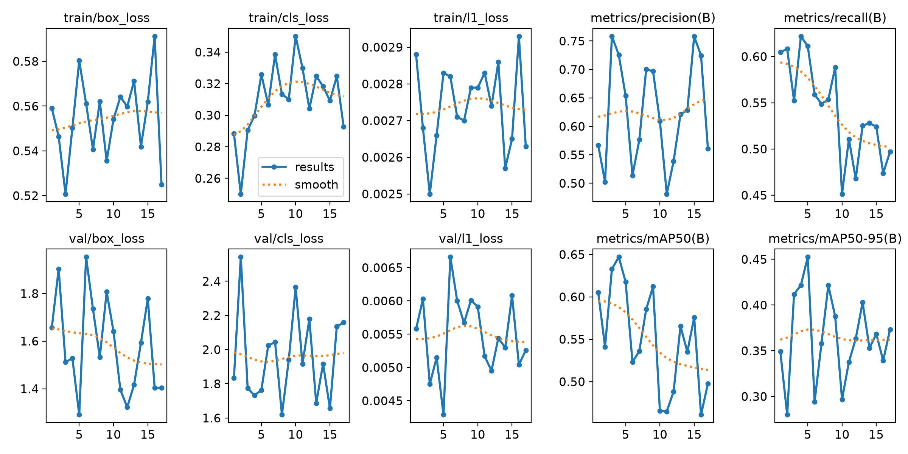
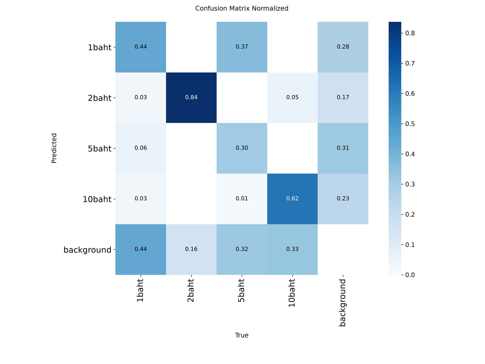

# AI_YOLO — ตรวจจับเหรียญไทยด้วย YOLO

โปรเจคตรวจจับและจำแนกเหรียญไทย 4 ชนิด ได้แก่ 1, 2, 5 และ 10 บาท ด้วย Ultralytics YOLO26 ครอบคลุมการแปลง annotation จาก Label Studio, การฝึกโมเดล และการทดสอบจากภาพ วิดีโอ และเว็บแคม

จากผลการทดลองที่บันทึกไว้ 4 รุ่น **v4 มีค่า validation mAP50–95 สูงสุด 45.25%** ส่วน **v3 มี Precision และ mAP50 สูงกว่า v4** เมื่อเปรียบเทียบแถวที่ได้ mAP50–95 สูงสุดของแต่ละรุ่น สคริปต์ทดสอบปัจจุบันยังใช้ checkpoint ของ v3

## ชุดข้อมูลและการแบ่ง Train / Validation

ตัวเลขต่อไปนี้นับจากภาพและ label ใน `dataset/` ที่อยู่ใน repository ปัจจุบัน ไม่ใช่การยืนยันจำนวนข้อมูลย้อนหลังของทุกการทดลอง

| ชุดข้อมูล | จำนวนภาพ | สัดส่วนภาพ | จำนวนกล่องเหรียญ | ภาพเหรียญเดียว | ภาพหลายเหรียญ |
| --- | ---: | ---: | ---: | ---: | ---: |
| Train | 601 | 84.89% | 997 | 468 | 133 |
| Validation | 107 | 15.11% | 319 | 15 | 92 |
| รวม | 708 | 100% | 1,316 | 483 | 225 |

| Class ID | เหรียญ | ชื่อคลาส | กล่อง Train | กล่อง Validation | รวม |
| --- | --- | --- | ---: | ---: | ---: |
| 0 | 1 บาท | `1baht` | 241 | 72 | 313 |
| 1 | 2 บาท | `2baht` | 253 | 92 | 345 |
| 2 | 5 บาท | `5baht` | 261 | 82 | 343 |
| 3 | 10 บาท | `10baht` | 242 | 73 | 315 |

[`01-export_dataset.py`](01-export_dataset.py) แปลงกรอบจาก Label Studio เป็น YOLO format และแบ่งข้อมูลตาม **กลุ่มวิดีโอ** จากโฟลเดอร์ต้นทางของภาพ เพื่อไม่ให้เฟรมจากกลุ่มเดียวกันกระจายไปทั้ง Train และ Validation สคริปต์ค้นหาชุดแบ่งที่ใกล้เป้าหมาย Validation 20% โดยพิจารณาจำนวนภาพ สัดส่วนกล่องแต่ละคลาส และการมีทั้งภาพเหรียญเดียวกับหลายเหรียญ

ผลการแบ่งปัจจุบันใช้กลุ่ม `IMG_7175`–`IMG_7184` จำนวน 10 กลุ่มสำหรับ Train และ `IMG_7195` เพียงกลุ่มเดียวสำหรับ Validation จึงได้สัดส่วนจริง 84.89 / 15.11 แทน 80 / 20

## การทดลอง v1–v4

ค่าการฝึกอ้างอิงจาก `args.yaml` ของแต่ละ run โดย v3 และ v4 เริ่มการฝึกใหม่จากน้ำหนัก `best.pt` ของรุ่นก่อนหน้า (`resume=false`)

| รุ่น | โมเดลเริ่มต้น | ขนาดภาพ | Batch | Epoch ที่ตั้งไว้ | Patience | Epoch ที่บันทึกจริง |
| --- | --- | ---: | ---: | ---: | ---: | ---: |
| [v1](runs/thai_coin_yolo26n-v1/args.yaml) | YOLO26n (`yolo26n.pt`) | 640 | Auto (`-1`) | 100 | 100 | 100 |
| [v2](runs/thai_coin_yolo26s_v2/args.yaml) | YOLO26s (`yolo26s.pt`) | 960 | 8 | 80 | 20 | 71 |
| [v3](runs/thai_coin_yolo26s_v3/args.yaml) | `best.pt` ของ v2 | 960 | 8 | 60 | 15 | 23 |
| [v4](runs/thai_coin_yolo26s_v4/args.yaml) | `best.pt` ของ v3 | 960 | 8 | 50 | 12 | 17 |

ทุก run ตั้งค่า `optimizer=MuSGD`, `device=0`, `lr0=0.01`, `lrf=0.01`, `seed=0` และ `deterministic=true` จำนวน epoch ของ v2–v4 สอดคล้องกับ early stopping: หยุดหลัง epoch ที่ได้ mAP50–95 สูงสุดอีก 20, 15 และ 12 epoch ตามค่า patience

v4 ทดลองลดความแรงของ augmentation จาก v1–v3 ดังนี้:

| Augmentation | v1–v3 | v4 |
| --- | ---: | ---: |
| `degrees` | 20 | 10 |
| `shear` | 3.0 | 1.5 |
| `perspective` | 0.0005 | 0.0002 |
| `mosaic` | 1.0 | 0.5 |
| `mixup` | 0.05 | 0.0 |
| `close_mosaic` | 10 | 15 |

ทุก run ใช้ `fliplr=0.5`, `flipud=0.5`, `translate=0.1` และ `scale=0.5` เหมือนกัน

## ผลการทดลอง

ตารางเลือก **แถวที่ `metrics/mAP50-95(B)` สูงสุดใน `results.csv` ของแต่ละ run** แล้วนำ Precision, Recall และ mAP50 จากแถวเดียวกันมาแสดง ทุกค่าแสดงเป็นเปอร์เซ็นต์ ไม่ใช่ค่าสูงสุดแยกคอลัมน์หรือผลจาก epoch สุดท้าย

| รุ่น | Epoch ที่เลือก | Precision | Recall | mAP50 | mAP50–95 |
| --- | ---: | ---: | ---: | ---: | ---: |
| [v1 — YOLO26n](runs/thai_coin_yolo26n-v1/results.csv) | 32 | 55.03% | 65.43% | 50.52% | 36.83% |
| [v2 — YOLO26s](runs/thai_coin_yolo26s_v2/results.csv) | 51 | 72.57% | 58.71% | 63.03% | 41.48% |
| [v3 — ต่อจาก v2](runs/thai_coin_yolo26s_v3/results.csv) | 8 | **79.36%** | 61.74% | **65.59%** | 43.91% |
| [v4 — ต่อจาก v3](runs/thai_coin_yolo26s_v4/results.csv) | 5 | 65.40% | 61.13% | 61.76% | **45.25%** |

Precision บอกสัดส่วนการตรวจจับที่ถูกต้องจากสิ่งที่โมเดลทำนาย ส่วน Recall บอกสัดส่วนเหรียญจริงที่ตรวจพบ mAP50 ประเมินที่ IoU 0.50 และ mAP50–95 เฉลี่ยหลายเกณฑ์ IoU ตั้งแต่ 0.50 ถึง 0.95 จึงให้ความสำคัญกับความแม่นยำของตำแหน่งกรอบมากกว่า mAP50 เพียงค่าเดียว ค่าเหล่านี้ไม่ใช่ overall accuracy

### ข้อสังเกตจากผล

- v4 ได้ mAP50–95 สูงสุดใน log ที่ **45.25%** เพิ่มจาก v3 ประมาณ **1.34 จุดเปอร์เซ็นต์** แต่ Precision และ mAP50 ต่ำกว่า v3 จึงยังสรุปไม่ได้ว่า v4 ดีกว่าทุกด้าน
- v1 → v2 เปลี่ยนทั้งขนาดโมเดลและขนาดภาพ จึงแยกไม่ได้ว่าการเปลี่ยนแปลงของผลเกิดจากปัจจัยใดเพียงอย่างเดียว
- v4 เปลี่ยน augmentation หลายค่าและฝึกต่อจาก v3 ผลที่ได้จึงเป็นการเปรียบเทียบชุดการตั้งค่า ไม่ใช่การทดลองควบคุมเพื่อพิสูจน์ผลของ augmentation ตัวใดตัวหนึ่ง
- Confusion matrix ของ v4 ยังแสดงความสับสนระหว่างเหรียญ 1 บาทกับ 5 บาท และมีเหรียญที่ตรวจไม่พบ โดยเฉพาะเหรียญจริง 5 บาทที่ทำนายเป็น 1 บาท ไม่ควรตีความค่าทแยงของภาพนี้เป็น accuracy รวม

### ข้อจำกัดในการตีความ

ทุก run อ้างถึง path ของ dataset เดียวกัน แต่ไม่มี snapshot หรือ hash ของชุดข้อมูลย้อนหลังแยกตาม run จึงยืนยันไม่ได้ว่าทุกการทดลองใช้ภาพและ label ชุดเดียวกันทั้งหมด ตัวเลขข้างต้นเป็นผล validation ที่บันทึกไว้ ไม่ใช่ผลจากชุดทดสอบอิสระ

Validation ปัจจุบันมาจากวิดีโอเดียว (`IMG_7195`) และ `tests/IMG_7195.MOV` เป็นไฟล์เดียวกับวิดีโอต้นทางชื่อนี้ จึงไม่ใช้ผลจากวิดีโอดังกล่าวเป็นหลักฐานประเมินบนข้อมูลใหม่ที่แยกขาดจาก Validation ใน repository ยังไม่มีผลเชิงตัวเลขจากชุด Test อิสระ

การทดลองต่อไปควรจัดชุด Test จากวิดีโอใหม่ที่มีสภาพแสง พื้นหลัง ระยะกล้อง และการซ้อนทับต่างกัน แล้วเปรียบเทียบ v3 กับ v4 บนชุดเดียวกัน พร้อมบันทึกผลรายคลาสและความเร็วการตรวจจับ

## กราฟประกอบ

### ประวัติการฝึก v4



### Confusion matrix ของ v4

แกนแนวนอนเป็นคลาสจริง และแกนแนวตั้งเป็นคลาสที่โมเดลทำนาย ภาพนี้เป็นผลประเมินที่บันทึกไว้ใน run และไม่จำเป็นต้องตรงกับจุดประเมินของทุก metric ในตาราง CSV



ดูผลเพิ่มเติมได้ในโฟลเดอร์ [v1](runs/thai_coin_yolo26n-v1/), [v2](runs/thai_coin_yolo26s_v2/), [v3](runs/thai_coin_yolo26s_v3/) และ [v4](runs/thai_coin_yolo26s_v4/) ซึ่งมี `args.yaml`, `results.csv`, กราฟ Precision / Recall / F1 / PR และ `weights/best.pt`

## โครงสร้างโปรเจค

| ไฟล์ / โฟลเดอร์ | หน้าที่ |
| --- | --- |
| `dataset/` | ภาพและ labels ที่แบ่ง Train / Validation แล้ว พร้อม `data.yaml` และ `classes.txt` |
| `images/` | ภาพต้นฉบับ แยกตามกลุ่มวิดีโอ |
| `weights/yolo26n.pt`, `yolo26s.pt` | โมเดลตั้งต้น |
| `runs/<ชื่อการทดลอง>/` | ค่าการฝึก ผลการประเมิน กราฟ และ checkpoint ที่ดีที่สุดของแต่ละ run |
| `tests/` | ภาพและวิดีโอสำหรับทดลอง inference |
| `01-export_dataset.py` | แปลง annotation และแบ่ง Train / Validation ตามกลุ่มวิดีโอ |
| `02-train.py` | ค่าการฝึกของ v4 โดยเริ่มจาก checkpoint ของ v3 |
| `03-test_image.py` | ทดสอบจากภาพด้วย checkpoint ของ v3 |
| `04-test_video.py` | ทดสอบจากวิดีโอด้วย checkpoint ของ v3 |
| `05-test-camera.py` | ตรวจจับจากเว็บแคมด้วย checkpoint ของ v3 |

## ติดตั้งและใช้งาน

สร้าง virtual environment และติดตั้ง dependencies จากโฟลเดอร์โปรเจค:

```powershell
python -m venv env
.\env\Scripts\python.exe -m pip install -r requirements.txt
```

สคริปต์ที่กำหนด `device=0` ต้องใช้ GPU ที่ PyTorch รองรับ และติดตั้ง PyTorch ให้ตรงกับระบบของเครื่อง `requirements.txt` ยังไม่ได้ตรึงเวอร์ชัน จึงไม่รับประกันว่าการติดตั้งใหม่จะให้ผลตัวเลขตรงกับการทดลองเดิม

สคริปต์ปัจจุบันและ `dataset/data.yaml` ใช้ path บนเครื่องเดิมที่ `D:\AI_YOLO` ให้แก้ path หาก clone ไปตำแหน่งอื่น สคริปต์ทดสอบใช้ `runs/thai_coin_yolo26s_v3/weights/best.pt` และ `conf=0.25` หากต้องการเปรียบเทียบ v4 ให้เลือก `runs/thai_coin_yolo26s_v4/weights/best.pt` ในสคริปต์ที่ใช้ทดสอบ

```powershell
# ทดสอบภาพ / วิดีโอ / เว็บแคม
.\env\Scripts\python.exe 03-test_image.py
.\env\Scripts\python.exe 04-test_video.py
.\env\Scripts\python.exe 05-test-camera.py

# ฝึกด้วยค่าปัจจุบันของ v4
.\env\Scripts\python.exe 02-train.py
```

กด `q` เพื่อปิดหน้าต่างตรวจจับจากเว็บแคม

Repository มี dataset ที่แบ่งแล้ว หากต้องการสร้างใหม่ ให้วาง JSON export จาก Label Studio ที่โฟลเดอร์หลักและเตรียมภาพใน `images/` ตาม path ใน annotation ก่อนรันคำสั่งต่อไปนี้ ซึ่งจะ **ลบและสร้างโฟลเดอร์ `dataset/` ใหม่**:

## ตัวอย่างผลลัพธ์


```powershell
.\env\Scripts\python.exe 01-export_dataset.py
```

Virtual environment, JSON export ต้นฉบับจาก Label Studio ที่มีข้อมูลบัญชีผู้ทำ annotation, วิดีโอต้นฉบับใน `videos/`, dataset cache, `last.pt`, ภาพ preview ของ batch และผล inference ใน `runs/detect/` เก็บไว้ในเครื่องตาม `.gitignore` ส่วน dataset ที่แปลงแล้ว ภาพ โมเดล และผลการทดลองที่อ้างใน README นี้รวมอยู่ใน repository แล้ว
